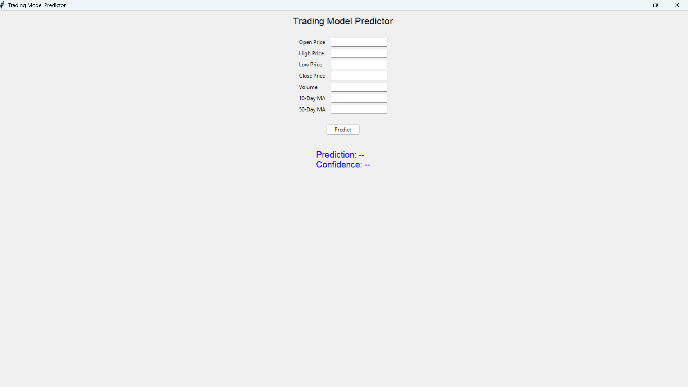

# AI-Driven Algorithmic Trading Model

This repository contains a machine learning-based algorithmic trading model that predicts stock market actions (Buy or Sell) based on historical stock data. The project includes data preprocessing, feature engineering, model training, and a graphical user interface (GUI) for real-time predictions.

---

## **Features**

- **Data Preprocessing**: Scales and cleans historical stock data for analysis.
- **Feature Engineering**: Adds moving averages (`MA_10`, `MA_50`) for stock trend analysis.
- **Machine Learning Model**: Utilizes a Random Forest classifier to predict stock actions.
- **Model Persistence**: Saves the trained model and scaler for future predictions.
- **GUI**: User-friendly interface for testing the model on new stock data.

---

## **Demo**

### **GUI**

The project provides a GUI to input stock features and receive predictions:

- Input stock data (e.g., Open, High, Low, Close, Volume, MA\_10, MA\_50).
- Get a "Buy" or "Sell" prediction instantly.

> **Screenshot**: Sample GUI Screenshot:


---

## **Project Structure**

├── data/\
│   └── trading\_data.csv # Example dataset\
├── gui/\
│   └── trading\_gui.py # GUI implementation\
├── models/\
│   ├── model.pkl # Trained machine learning model\
│   ├── scaler.pkl # Preprocessing scaler\
├── scripts/\
│   ├── train\_model.py # Model training script\
│   ├── prediction.py # Script for making predictions\
├── requirements.txt # Python dependencies\
├── README.md # Project documentation

---

## **Getting Started**

Follow these steps to set up and run the project locally.

### **1. Clone the Repository**

Clone the repository to your local machine:

```bash
git clone https://github.com/adarshpheonix2810/ai-algorithmic-trading.git
cd ai-algorithmic-trading
pip install -r requirements.txt
python scripts/train_model.py
```

### **2. Install Dependencies**

Install the required Python libraries:

```bash
pip install -r requirements.txt
```

### **3. Prepare the Dataset**

Place your stock market dataset (`trading_data.csv`) in the `data/` directory.\
The dataset must include the following columns:

- Open, High, Low, Close, Volume, MA\_10, MA\_50, Target

If you're using the sample dataset provided, skip this step.

### **4. Train the Model**

Run the training script to train the Random Forest model:

```bash
python scripts/train_model.py
```

This will:

- Train the machine learning model.
- Save the model as `model.pkl` in the `models/` directory.
- Save the scaler as `scaler.pkl` in the `models/` directory.

### **5. Test the GUI**

Launch the GUI to make predictions:

```bash
python gui/trading_gui.py
```

### **6. Make Predictions via Script (Optional)**

You can also make predictions programmatically using the `prediction.py` script:

```python
from scripts.prediction import predict_stock_action

# Example stock data input
input_data = [[150.0, 155.0, 148.0, 152.0, 1000000, 151.0, 150.5]]
prediction = predict_stock_action(input_data)
print("Prediction:", "Buy" if prediction == 1 else "Sell")
```

---

## **Requirements**

This project requires Python 3.8+ and the following libraries:

- `numpy`
- `pandas`
- `scikit-learn`
- `joblib`
- `tkinter`
- `matplotlib`
- `yfinance` (optional, for fetching real-time stock data)

All dependencies are listed in `requirements.txt`. Install them using:

```bash
pip install -r requirements.txt
```

---

## **Dataset Overview**

**Columns Description:**

- **Open**: The opening price of the stock.
- **High**: The highest price of the stock during the trading day.
- **Low**: The lowest price of the stock during the trading day.
- **Close**: The closing price of the stock.
- **Volume**: The total number of shares traded during the day.
- **MA\_10**: 10-day moving average of the closing price.
- **MA\_50**: 50-day moving average of the closing price.
- **Target**: A binary label where 1 represents "Buy" and 0 represents "Sell".

---

## **How the Model Works**

**Dataset:**

- **Features**: Open, High, Low, Close, Volume, MA\_10, MA\_50
- **Target**: 1 for "Buy" and 0 for "Sell"

**Preprocessing:**

- Data is cleaned and scaled using `StandardScaler`.

**Training:**

- A Random Forest classifier is trained on the preprocessed data.

**Prediction:**

- The trained model predicts "Buy" (1) or "Sell" (0) based on input features.

**GUI:**

- Allows users to test predictions interactively by inputting stock data.

---

## **Project Highlights**

1. **Real-World Applicability**: Simulates an algorithmic trading decision-making system.
2. **Interactive GUI**: Makes the model accessible for non-technical users.
3. **Extensible**: Easily integrate real-time stock data from APIs like Yahoo Finance or Alpha Vantage.

---

## License
This project is licensed under the [MIT License](LICENSE). See the LICENSE file for more details.

